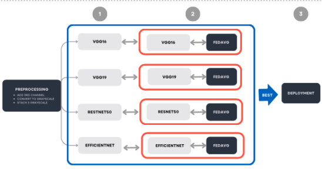
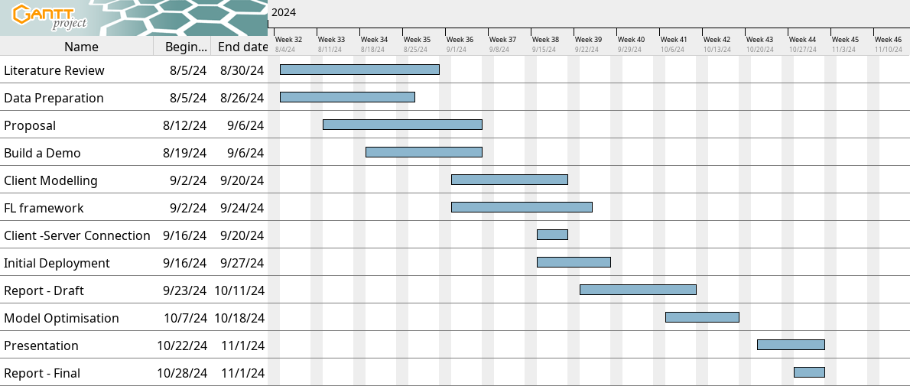

# Project Problems 

## Project Aims and Objectives 

The objective of this project is to develop a predictive tool for faster intervention and treatment of potential gastric cancer diagnoses. The project will focus on the histological analysis of gastrointestinal tissues, leveraging advanced image classification techniques and Federated Learning to ensure data privacy. The emphasis on Federated Learning enables collaboration between multiple institutions without sharing sensitive patient data, offering potential applications beyond gastric cancer diagnosis to other clinical contexts. The tool aims to aid in early detection, improving treatment outcomes while maintaining compliance with data privacy regulations. 

## Project Questions 

- Can a single image classification model trained on a small dataset (single clinic) outperform the same model developed across multiple datasets (multiple clinics) using Federated Learning to ensure data privacy? 

- Can Federated Learning enhance the predictive performance of models trained in different clinical settings? 

## Project Scope 
 

**Model Development:** Implement a federated learning model in PyTorch to detect gastric cancer from medical images. 

**Data Preprocessing:** Build pipelines to clean, normalise, and augment imaging data across nodes for consistent input quality. 

**Performance Evaluation:** Validate the model using accuracy, precision, recall, F1-score, and AUC-ROC metrics across diverse datasets. 

**Model Deployment:** Deploy the model on distributed systems (e.g., Docker, AWS) to enable collaborative training without data sharing. 

**Documentation and Reporting:** Document model architecture, implementation, and results, and deliver a final report summarizing research and outcomes. 

# Methodologies 

The methods to solve the problem will mainly focus on Federated Learning. To do this, the team will start with a pre-trained model and leverage transfer learning to apply it to this context. Referencing other studies, the team plan to test and use one of the following common deep learning architectures: VGG16, VGG19, ResNet50, or EfficientNet v2. Specifically, the team will “unfreeze” some layers of the model, ensuring that the model can be retrained for the planned binary classification task. The resulting model will serve as the baseline for future experiments. To begin the process, the training will be done on a small subset of the data to simulate how the model performs in a single clinical setting. 

The team will then build a Federated Learning framework that will allow the simulation of training across multiple clinics without sharing raw data, effectively ensuring data privacy. The approach would be model-centric and cross-silo, meaning that the global model will be trained collaboratively across multiple clinics (each with their own assigned local data) to improve the global model. The goal is to see how well the federated model performs compared to the baseline trained on the simulated single clinic’s data. 

## Data Collection and Data Analysis 

The dataset for this project will be the GasHisSDB dataset. This dataset consists of 245,196 image patches from six hundred gastric cancer whole-slide images (2048x2048 pixels). Normal images contain no cancerous regions, with cells showing little to no atypia, regular single-layer arrangement, and minimal mitosis. These characteristics make them easily identifiable as normal under a microscope, allowing whole images to be directly cropped for dataset creation. Abnormal images feature gastric cancer, typically ulcer-shaped, infiltrating from the mucosal to muscle and serosal layers. Cancer cells may appear in nests, glands, or irregular arrangements, with unclear boundaries when infiltrating stroma. Cropped images focus on regions with at least 50% cancerous areas. The H&E staining method, the gold standard in histology, stains nuclei purplish-blue and cytoplasm pink, making cellular structures easily distinguishable. Normal images display more pink and white areas, while abnormal ones have more disorganised purplish-blue regions [@huGasHisSDBNewGastric2022]. 

## Data Preprocessing 

Images will be resized to 224x224 pixels and divided into four subsets to simulate different clinical settings. Since the images are limited to two colour channels, three approaches are available for conversion to three channels: 

1. Repeating one of the existing channels. 

2. Converting to grayscale by averaging the existing channels. 

3. Stacking three grayscale channels. 

Normalisation in this context means converting the pixel values of the image (which range from 0 to 255) into a range between 0 and 1 by dividing each value by 255. After that, the pixel values are adjusted using known parameters for existing models, mean [0.485, 0.456, 0.406] and standard deviation [0.229, 0.224, 0.225] for each channel. This adjustment ensures that the input data matches the distribution that the pre-trained model was originally trained on. Furthermore, the data will be divided into four different batches to simulate four distinct clinics, each representing a client in the federated learning setup. The batches will then be split into training, validation, and testing sets in a 60:20:20 ratio. 

## Predictive Modelling and Evaluation

{ width=90% }

The evaluation will be conducted in two stages: 

1. **Training the Predictive Model (Pre-trained Models).** Four pre-trained models (VGG19, VGG16, ResNet50, EfficientNet) will be fine-tuned for binary classification, and trained on centralised data. The performances will be evaluated using accuracy, precision, recall, and F1-score to assess their suitability for the task. 

2. **Applying Federated Learning (FedAvg) to Pre-trained Models.** After evaluating the standalone pre-trained models, Federated Averaging (FedAvg) will be applied. The global model, initialised with ImageNet weights, will be distributed to clients. Each client fine-tunes the model on local data, and updated model parameters are aggregated by the server. This process will be repeated for multiple communication rounds. The final performance of these federated models will be compared to the standalone pre-trained models to determine if Federated Learning improves their performance. 

3. **Deployment of the Best Performing Model.** Once the evaluation is complete, the best performing model, whether a standalone pre-trained model or a federated model, will be selected for deployment in production.  

# Resources 

## Materials 

- **PyTorch:** Frameworks for building and training the federated learning model. 

- **OpenMined / PySyft:** Tools for enabling federated learning and privacy-preserving machine learning. 

- **Poetry:** Python dependency management and environment setup. 

- **AWS S3:** For storing data such as gastric cancer image datasets. 

- **Google Colab:** For enabling deep learning with GPU standards. 

- **GitHub:** For version control and collaboration. 

- **Slack:** For commucation and collaboration. 

- **Microsoft Teams:** For project management, sharing dataset and online meeting. 

\newpage

## Roles and Responsibilities

| Name                    | Roles & Responsibilities                                                                                          |
| ----------------------- | ----------------------------------------------------------------------------------------------------------------- |
| David Bain              | Develop Client model, implement integrated model, handle version control (GitHub), report writing                 |
| Emmanuel Niko Sindayen  | Direct the research aspects of the federated learning model, and develop federated learning model, report writing |
| James Murray            | Develop Client model, implement integrated model, manage all written reports                                      |
| inh Thanh Nguyen        | ead models development (Build and train the federated learning model using PyTorch), report writing               |
| Taekjin Jeong           | Develop Client model, Project management, support research aspects, report writing                                |
| Warisara Siriponpaiboon | Direct the research aspects of the federated learning model, and develop federated learning mode, coordinate communication. Report writing  |
Table: Roles and Responsibilities

# Expected Outcomes 

## Materials 

- **Federated Learning Model:** A fully trained federated learning model capable of diagnosing gastric cancer from medical imaging data. This model will be distributed across multiple nodes, allowing for decentralised data processing while maintaining patient privacy. 

- **Data Preprocessing Pipeline:** A robust pipeline for cleaning, normalising, and augmenting the medical imaging data to ensure high-quality input for the federated learning model. 

- **Thesis:** The Thesis will provide the entire research and development process of the project. It will cover the theoretical background, methodology, experimental results, and discussions. The thesis will serve as a key academic deliverable and contribution to the field of medical AI and federated learning. 

# Milestone - Schedule

A project plan was developed, and the Gantt chart below highlights the key timelines associated with the project's critical elements. While this seems linear in its application, there is a significant amount of concurrent activity in preparation for each task. There are also numerous sub-tasks associated with each of the milestones outlined below.  

{ width=90% }

# Conclusion 

The project proposal outlined above highlights state of the art methods that could be applied in a medical context. While this has been done by others the opportunity to test and subsequently demonstrate some of these techniques in a Data sensitive context should not be underestimated, it should however, be embraced. These state of the art methods have the potential to assist in overcoming some of the significant challenges of applying machine learning in the Data sensitive context of the medical domain. The potential for machine learning to contribute to better patient care is significant. Federated Learning is one method that could enable a significant acceleration and uptake machine learning in the medical field, assisting physicians and ultimately improving patient outcomes.  